# End-to-End E-Commerce Big Data Pipeline

A batch-oriented Big Data pipeline that generates synthetic e-commerce data, stores it in HDFS, processes it with Apache Spark, loads it into a Star Schema Data Warehouse, and validates integrity — all orchestrated by Apache Airflow inside Docker.

---

## Architecture

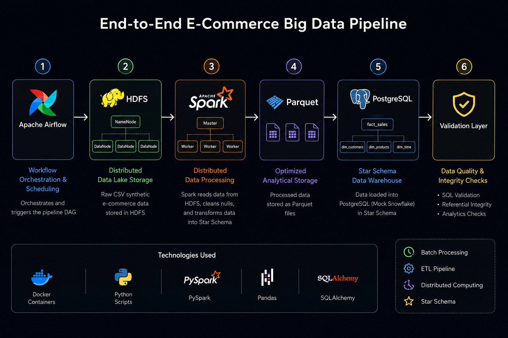

**Pipeline stages:** Data Ingestion → HDFS Storage → Spark Processing → DWH Load → Validation

```text
+------------------+     +--------------------+     +----------------------+
|  Airflow         | --> |  HDFS              | --> |  Spark Cluster       |
|  (Orchestrator)  |     |  (Raw Data Lake)   |     |  (Distributed Proc.) |
+------------------+     +--------------------+     +----------------------+
        |                                                      |
        v                                                      v
+------------------+                             +----------------------+
|  Validation Task |<----------------------------|  PostgreSQL (DWH)    |
|  (Data Quality)  |                             |  (Mock Snowflake)    |
+------------------+                             +----------------------+
```

---

## Technology Stack

| Component | Technology |
| --------- | ---------- |
| Orchestration | Apache Airflow 2.8.0 |
| Storage | Hadoop HDFS 3.2.1 |
| Processing | Apache Spark 3.5.0 |
| Data Warehouse | PostgreSQL 15 (Mock Snowflake) |
| Language | Python 3.10 |
| Containerization | Docker & Docker Compose |
| Data Formats | CSV / Parquet |
| ORM | SQLAlchemy 1.4.49 |

---

## Infrastructure

All services run as Docker containers. The environment requires **8 GB RAM** and **4 CPU cores** minimum.

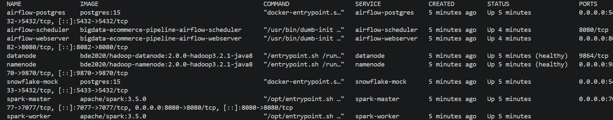

### Required Ports

| Port | Service |
| ---- | ------- |
| 8080 | Spark Master UI |
| 8082 | Airflow UI |
| 9870 | HDFS NameNode UI |
| 5432 | Airflow PostgreSQL |
| 5433 | Mock Snowflake |

---

## Quick Start

```bash
# 1. Start all services
docker compose up -d

# 2. Initialize Airflow metadata DB
docker compose run --rm airflow-scheduler airflow db migrate

# 3. Restart Airflow
docker compose restart airflow-webserver airflow-scheduler

# 4. Create admin user
docker compose exec airflow-webserver airflow users create \
    --username admin --firstname Admin --lastname User \
    --role Admin --email admin@example.com --password admin
```

Then open **http://localhost:8082** (admin / admin), enable `ecommerce_bigdata_pipeline`, and trigger it.

---

## Airflow DAG

Five sequential tasks run end-to-end:

```
ingest_generate_data → upload_to_hdfs → spark_processing → load_to_snowflake → validate_data_warehouse
```

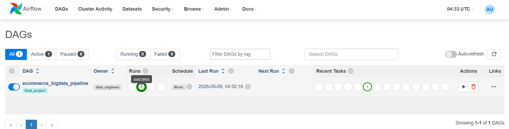

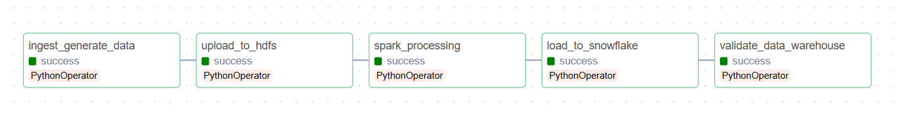

---

## HDFS — Distributed Storage

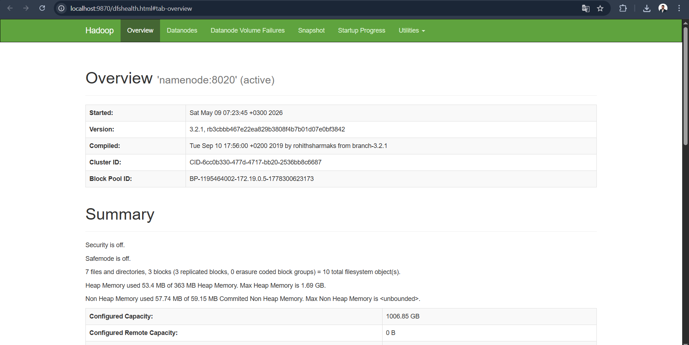

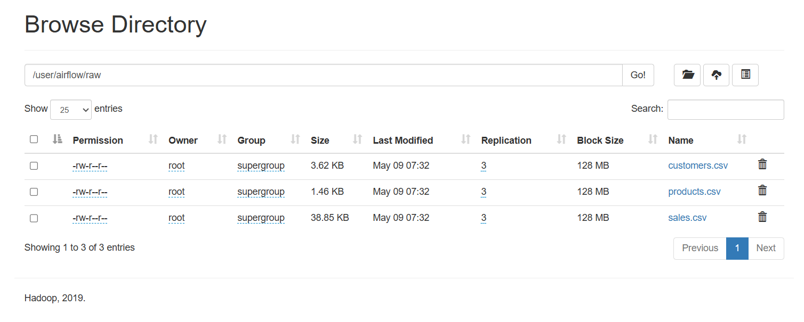

---

## Spark — Distributed Processing

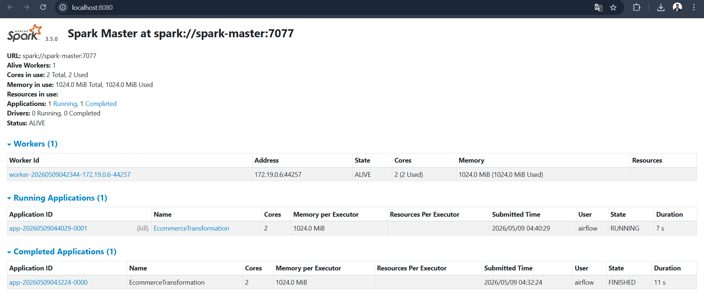

---

## Data Warehouse Schema

Star Schema with one fact table and three dimension tables:

- **`fact_sales`** — sale_id, customer_id, product_id, sale_date_key, sale_hour_key, quantity, total_amount
- **`dim_customers`** — customer attributes
- **`dim_products`** — product details and categories
- **`dim_time`** — time-based analytical attributes

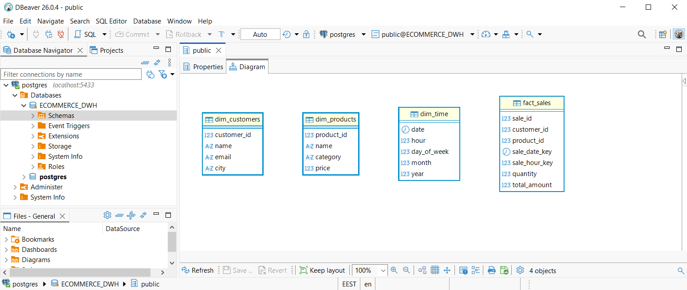

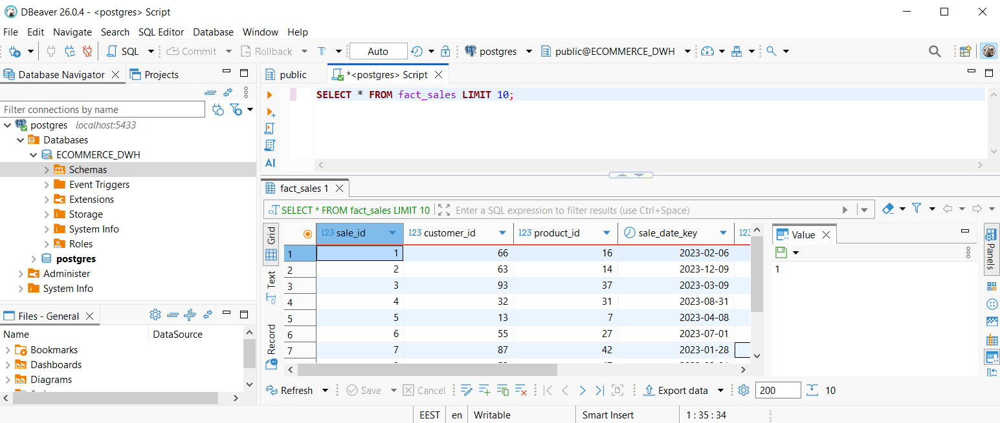

---

## Validation

The final DAG task runs automated checks for row counts, revenue consistency, referential integrity, and orphan records.

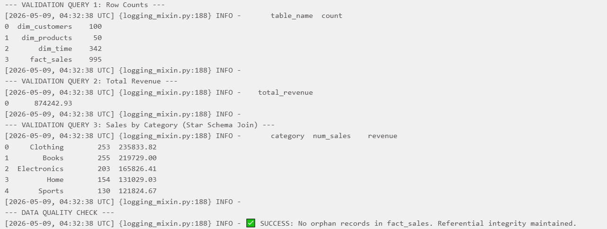

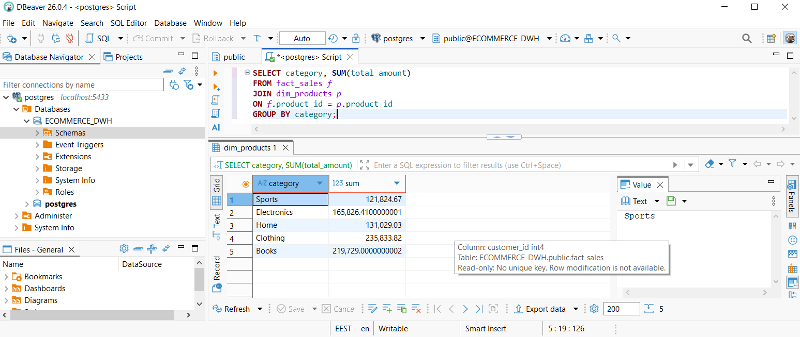

---

## Service URLs

| Service | URL | Credentials |
| ------- | --- | ----------- |
| Airflow UI | http://localhost:8082 | admin / admin |
| Spark Master UI | http://localhost:8080 | — |
| HDFS NameNode UI | http://localhost:9870 | — |
| Mock Snowflake | localhost:5433 | snowflake_user / snowflake_pass |

---

## Shutdown

```bash
docker compose down        # stop containers
docker compose down -v     # stop and wipe volumes (requires re-initialization)
```

---

## Known Limitations

- Full refresh strategy (no incremental loading)
- Single Spark worker
- `.toPandas()` used for local Parquet staging (not production-scale)
- No streaming / Kafka / CDC pipelines

## Future Improvements

Kafka streaming · Incremental loading · CDC · Multi-worker Spark · Real Snowflake · CI/CD · Monitoring
